# Employee Self-Service Portal (ESS) for Odoo 19

A modern, comprehensive Employee Self-Service portal for Odoo 19 Enterprise Edition with a clean Neo-Brutalist design.

## 💰 Key Objectives

- **Reduce Internal User License Costs** - Portal users don't require Odoo internal user licenses, saving significant costs while maintaining full HR functionality
- **Improve Employee Experience** - Intuitive, self-service workflows reduce HR department burden
- **Enhance Data Accessibility** - Employees can access their HR data 24/7 without HR intervention
- **Streamline HR Processes** - Automated workflows for leave, attendance, and expenses
- **Maintain Security** - Enterprise-grade row-level security ensures data isolation

## Features

### 🎯 Core Modules

- **Leave Management**
  - Request and track leave with approval workflows
  - View leave balance by type
  - Refuse requests with optional notes
  - Automatic leave balance calculations

- **Attendance & Time Tracking**
  - Clock in/out directly from portal
  - View attendance history
  - Request attendance corrections
  - Automatic worked hours calculation

- **Payslips**
  - Download payslips as PDF
  - View payment history
  - Search by date range

- **Expense Management**
  - Submit expense claims
  - Track reimbursement status
  - Attach receipts and documentation

- **Timesheets**
  - Weekly timesheet calendar view
  - Log hours by project and task
  - Quick-add buttons for frequent projects
  - Edit/delete unsubmitted entries
  - Submit for approval

- **Projects & Tasks**
  - Browse active projects
  - View assigned tasks with priority
  - Track task progress
  - Filter by project

- **Dashboard**
  - Leave request status overview
  - Pending approvals count
  - Quick-action buttons
  - Attendance status indicator
  - Weekly hours summary

## Design

### Neo-Brutalist Aesthetic
- Bold borders and minimal styling
- High contrast, clean typography
- Functional design focused on usability
- Mobile-responsive layouts

### Security
- Portal-based role-based access control
- Row-level security rules per model
- User sees only their own records
- Strict domain filtering on all queries

## Screenshots

### Dashboard
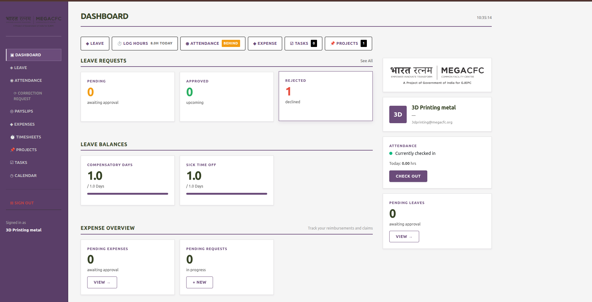
*Quick overview of pending requests, leave balance, and quick-action buttons*

### Leave Management
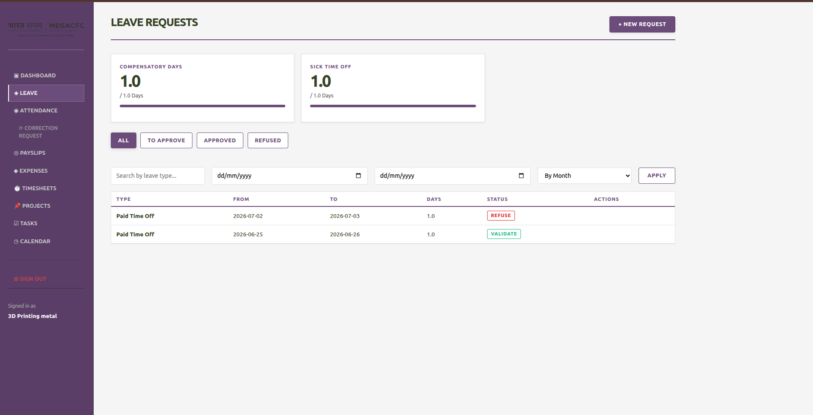
*Request leave with approval workflow*

### Attendance & Time Tracking
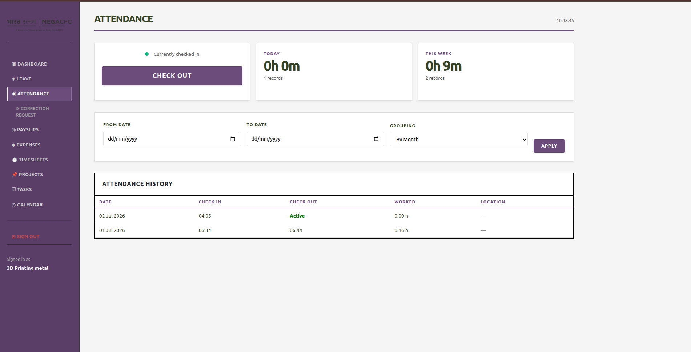
*Clock in/out directly from the portal*

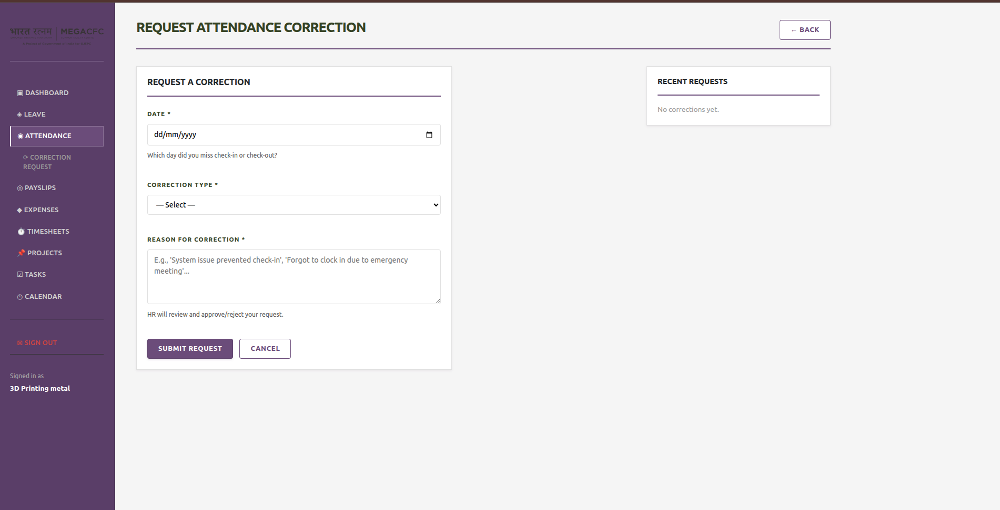
*View attendance records and corrections*

### Timesheets
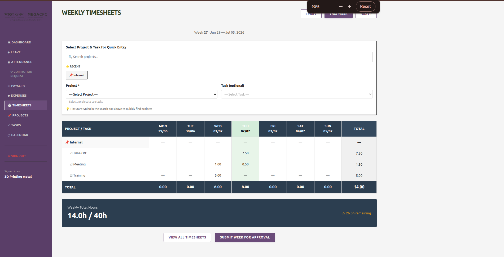
*Modern weekly calendar view for logging hours by project*

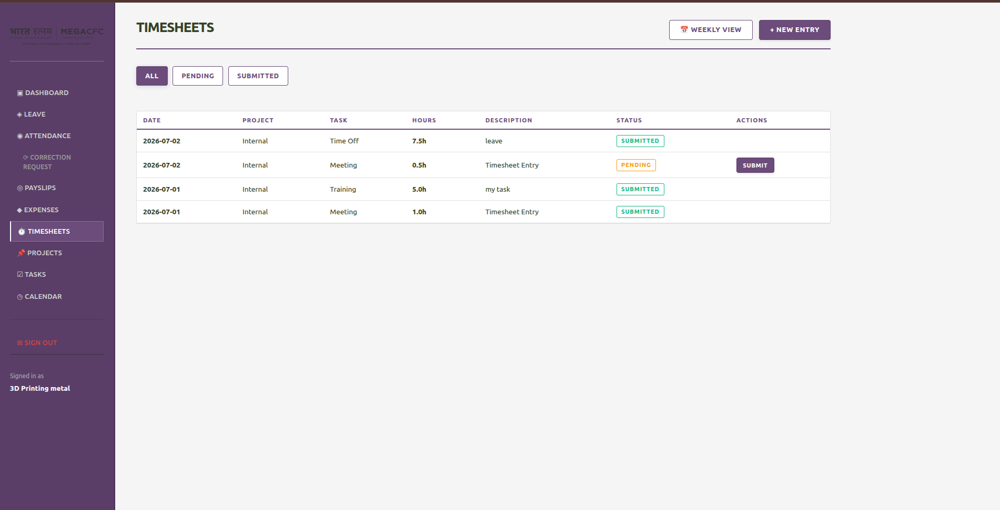
*Quick modal for adding/editing timesheet entries*

### Payslips
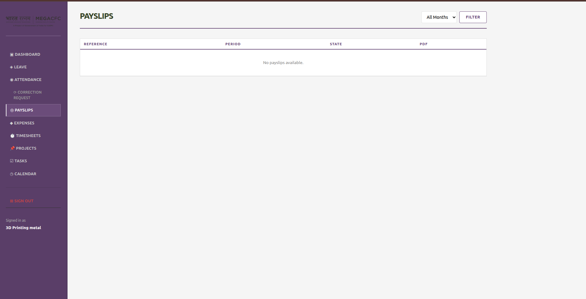
*View and download payslips as PDF*

### Expense Management
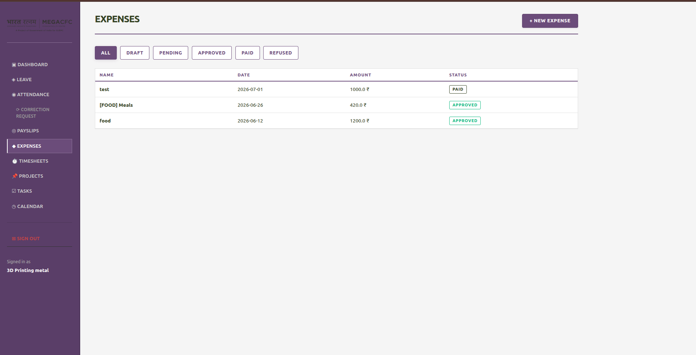
*Submit expense claims with receipt attachments*

### Projects & Tasks
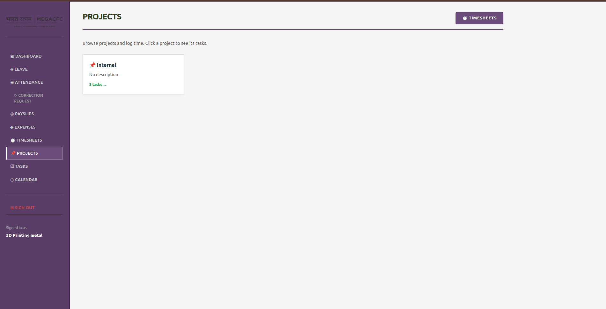
*Browse active projects and assigned work*

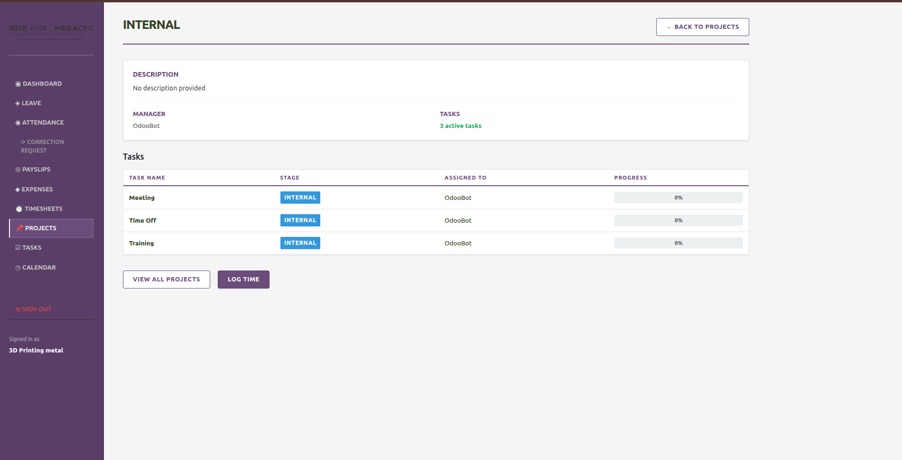
*View assigned tasks with priority and progress*

### Calender View
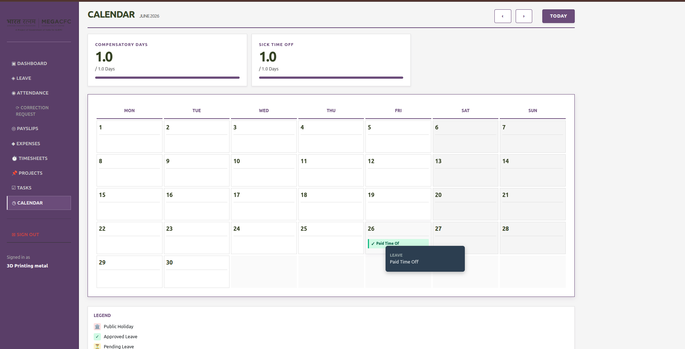
*Fully responsive design works seamlessly on mobile devices*

## Installation

### Requirements
- Odoo 19 Enterprise Edition
- Python 3.8+
- Required modules: `hr`, `hr_attendance`, `hr_holidays`, `hr_expense`, `hr_payroll`, `project`, `hr_timesheet`, `portal`

### Steps

1. **Clone the repository**
   ```bash
   git clone https://github.com/meet1432/hr-ess-portal.git
   cd hr-ess-portal
   ```

2. **Copy to Odoo addons directory**
   ```bash
   cp -r hr_ess_portal /path/to/odoo/addons/
   ```

3. **Install the module**
   - Log in to Odoo
   - Go to Apps → Search for "Employee Self-Service Portal"
   - Click Install

4. **Configure access**
   - Ensure users are assigned to "Portal" group
   - Users will automatically see only their own records

## Usage

### For Employees

1. **Dashboard**
   - Access via `/my/dashboard`
   - View quick stats and pending approvals
   - Click action buttons for common tasks

2. **Leave Management**
   - Request leave: Dashboard → "Request Leave"
   - View balance and approval status
   - Edit/cancel unsubmitted requests

3. **Timesheet Entry**
   - Access via `/my/timesheets/weekly`
   - Click any cell to add hours
   - Modal prefills existing entries for editing
   - Submit week for approval

4. **Attendance**
   - Clock in/out from Dashboard or Attendance page
   - Request corrections if needed

### For Administrators

1. **Security Rules**
   - Located in `security/hr_ess_portal_rules.xml`
   - Customize access per model as needed
   - Follow Odoo portal security patterns

2. **Customization**
   - CSS: `static/src/css/ess_portal.css`
   - JavaScript: `static/src/js/`
   - Templates: `views/portal_*_templates.xml`

## API Endpoints

All endpoints require portal user authentication and are prefixed with `/my/` or `/ess/`

### Leaves
- `GET /my/leaves` - List leave requests
- `GET /my/leaves/new` - Request new leave
- `POST /my/leaves/submit` - Submit leave request

### Attendance
- `GET /my/attendance` - View attendance records
- `POST /my/attendance/checkin` - Clock in
- `POST /my/attendance/checkout` - Clock out

### Timesheets
- `GET /my/timesheets/weekly` - Weekly calendar view
- `GET /my/timesheets` - List all entries
- `POST /my/timesheets/quick-entry` - Add/update entry
- `POST /my/timesheets/delete` - Delete entry

### Projects & Tasks
- `GET /ess/projects` - List projects
- `GET /ess/projects/<id>` - Project details
- `GET /ess/tasks` - List tasks

## Technical Details

### Architecture

- **Framework**: Odoo 19 Portal
- **Frontend**: OWL 3 components + vanilla JS
- **Database**: PostgreSQL (via Odoo)
- **Security**: Row-level access control via `ir.rule`

### File Structure

```
hr_ess_portal/
├── __manifest__.py                 # Module metadata
├── README.md                       # This file
├── LICENSE                         # LGPL-3 license
├── controllers/
│   └── portal.py                  # HTTP routes and business logic
├── models/
│   ├── __init__.py
│   ├── hr_leave.py                # Leave extensions
│   ├── hr_timesheet.py            # Timesheet extensions
│   └── ...
├── security/
│   ├── ir.model.access.csv        # Access control
│   └── hr_ess_portal_rules.xml     # Row-level rules
├── views/
│   ├── portal_dashboard_templates.xml
│   ├── portal_leave_templates.xml
│   ├── portal_timesheets_weekly_templates.xml
│   └── ...
├── static/
│   └── src/
│       ├── css/ess_portal.css
│       └── js/
│           ├── ess_dashboard.js
│           ├── timesheet_weekly.js
│           └── ...
├── data/
│   └── portal_menu_data.xml       # Portal menu items
└── wizard/
    └── leave_request_views.xml    # Leave request wizard
```

## Configuration

### Leave Types
- Configure via Settings → Human Resources → Leave Types
- Portal will automatically show configured types to employees

### Projects
- Create projects in Projects app
- Enable "Allow Timesheets" on project
- Projects become available in ESS portal

### Security Rules
Edit `security/hr_ess_portal_rules.xml` to customize access:

```xml
<record id="rule_name" model="ir.rule">
    <field name="name">Rule Name</field>
    <field name="model_id" ref="model_name"/>
    <field name="groups" eval="[(4, ref('base.group_portal'))]"/>
    <field name="domain_force">[('user_id', '=', user.id)]</field>
</record>
```

## Customization

### CSS Styling
- Edit `static/src/css/ess_portal.css`
- Use Neo-Brutalist design patterns:
  - `border-2 border-black` for cards
  - Minimal rounded corners
  - High contrast colors

### Adding Modules
1. Create new template in `views/`
2. Add controller route in `controllers/portal.py`
3. Update `__manifest__.py` data list
4. Add security rules if needed

### JavaScript
- ES6+ syntax
- Functions attached to `window` for onclick handlers
- Use `document.addEventListener('DOMContentLoaded')` for setup

## Testing

### Manual Testing
1. Create test employee with portal access
2. Test each module:
   - Leave: request, view balance, cancel
   - Attendance: check in/out
   - Timesheet: add, edit, delete entries
   - Expenses: submit claim
   - Projects: view and filter

### Security Testing
- Verify users see only their own records
- Try accessing other users' timesheets (should fail)
- Test with different user roles

## Performance

### Optimization Tips
1. Use `sudo()` carefully - only for portal data
2. Batch operations with `.search()` limits
3. Cache template results
4. Use indexed fields in domain filters

### Database Indexes
Recommended indexes for large installations:
```sql
CREATE INDEX idx_analytic_employee_date ON account_analytic_line(employee_id, date);
CREATE INDEX idx_leave_employee_date ON hr_leave(employee_id, date_from);
```

## Troubleshooting

### Users can't see portal
- Check user is in "Portal" group
- Verify user has employee record

### Timesheet entries not saving
- Clear browser cache
- Check console for JavaScript errors
- Verify employee is linked to user

### Permission errors
- Review `ir.model.access.csv`
- Check `security/hr_ess_portal_rules.xml`
- Ensure user has correct groups

## Contributing

We welcome contributions! Please:

1. Fork the repository
2. Create a feature branch
3. Make your changes
4. Add tests if applicable
5. Submit a pull request

See [CONTRIBUTING.md](CONTRIBUTING.md) for detailed guidelines.

## License

This module is licensed under the LGPL-3 License. See [LICENSE](LICENSE) file for details.

## Support

- **Documentation**: See README.md and inline code comments
- **Issues**: Report bugs on GitHub Issues
- **Discussions**: Ask questions on GitHub Discussions

## Changelog

See [CHANGELOG.md](CHANGELOG.md) for version history and updates.

## Authors

- **Meet Patel** - Initial development
- See [CONTRIBUTORS.md](CONTRIBUTORS.md) for full list

## Acknowledgments

- Built on Odoo 19 portal framework
- Neo-Brutalist design inspiration
- Community feedback and contributions

---

**Made with ❤️ for the Odoo community**
